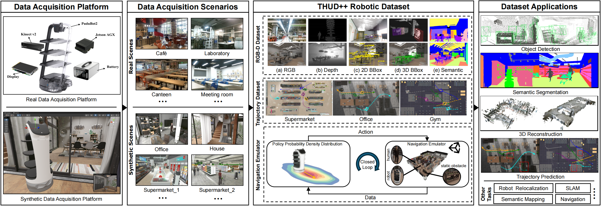
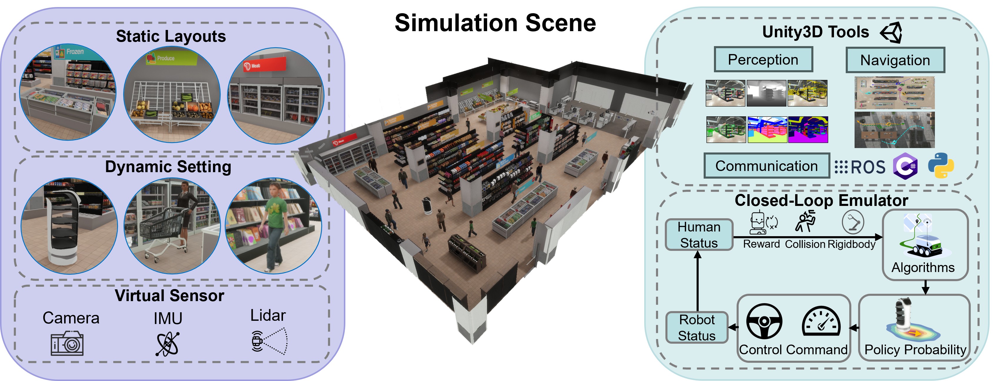

<div align="center">
<h1>THUD++: Large-Scale Dynamic Indoor Scene Dataset and Benchmark for Mobile Robots</h1>

[**Zeshun Li**](https://github.com/lzes)<sup>1*</sup> · [**Fuhao Li**](https://scholar.google.com/citations?user=AXTFYCcAAAAJ&hl=zh-CN&oi=sra)<sup>1*</sup> · [**Wanting Zhang**](https://scholar.google.com/citations?user=V6mBA5IAAAAJ)<sup>1*</sup>
<br>
[**Zijie Zheng**](https://github.com/Anthony-Cheang) · [**Xueping Liu**](https://www.sigs.tsinghua.edu.cn/lxp/main.htm)<sup>1</sup> · [**Tao Zhang**](https://www.pudutech.com/zh-CN)<sup>2</sup> · [**Yongjin Liu**](https://www.cs.tsinghua.edu.cn/info/1116/3535.htm)<sup>1</sup> · [**Long Zeng**](https://jackyzengl.github.io/)<sup>1&dagger;</sup>

<sup>1</sup>THU&emsp;&emsp;&emsp;<sup>2</sup>PUDU Tech
<br>
*equal contribution&emsp;&dagger;corresponding author

<a href="https://arxiv.org/abs/2412.08096"></a>
<a href="https://ieeexplore.ieee.org/abstract/document/10611489"></a>
<a href='https://jackyzengl.github.io/THUD-plus-plus.github.io/'></a>
</div>

## 🧭 Overview

THUD++ comprises three primary components: an RGB-D dataset, a pedestrian trajectory dataset, and a robot navigation emulator. By sharing this dataset, we aim to accelerate the development and testing of mobile robot algorithms,contributing to real-world robotic applications.

## 📃 Usage
### 1. RGB-D Dataset
Please refer to [THUD_Dataset_Overview](https://github.com/jackyzengl/THUD_Dataset_Overview) 

### 2. Pedestrian Trajactory Prediction
#### Prepraration
```bash
git clone https://github.com/jackyzengl/THUD++.git
conda create -n thud++ python=3.8
conda activate thud++
pip install -r requirements.txt
```

#### Dataset Structure
The construction of the dataset is the same as that of ETH/UCY. Each row in the data set is recorded according to frameID, pedID, x, y. The data of each scene is named after the scene and world coordinate system range.
```
Dataset
├── eth
│   ├── train
│   ├── val
│   ├── test_eth
│   ├── test_gym
│   ├── test_hotel
│   ├── test_office
│   ├── test_supermarket
├── gym
│   ├── gym_x[-7,7]_y[-14.4,14.8].txt
├── office
│   ├── office_x[-43.6,-35.5]_y[0.25,17].txt
├── supermarket
│   ├── supermarket_x[-26,-3]_y[-8,8].txt
```

#### Evaluation
```bash
cd traj_pred/tools/FLA/sgan/scripts && python evaluate_model.py
cd traj_pred/tools/FLA/pecnet/scripts && python test_pretrained_model.py
cd traj_pred/tools/FLA/stgcnn && python test.py
```

### 3. Navigation Emulator

The code of our Emulator is coming soon.

## 🖊 Citation

If you find this project useful, please consider citing:

```bibtex
@article{li2024thud++,
  title={THUD++: Large-Scale Dynamic Indoor Scene Dataset and Benchmark for Mobile Robots},
  author={Li, Zeshun and Li, Fuhao and Zhang, Wanting and Zheng, Zijie and Liu, Xueping and Liu, Yongjin and Zeng, Long},
  journal={arXiv preprint arXiv:2412.08096},
  year={2024}
}

@inproceedings{tang2024mobile,
  title={Mobile robot oriented large-scale indoor dataset for dynamic scene understanding},
  author={Tang, Yi-Fan and Tai, Cong and Chen, Fang-Xing and Zhang, Wan-Ting and Zhang, Tao and Liu, Xue-Ping and Liu, Yong-Jin and Zeng, Long},
  booktitle={2024 IEEE International Conference on Robotics and Automation (ICRA)},
  pages={613--620},
  year={2024},
  organization={IEEE}
}
```