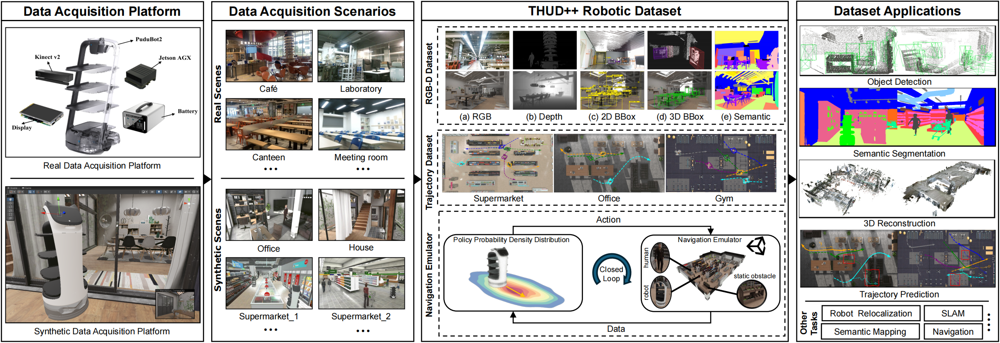
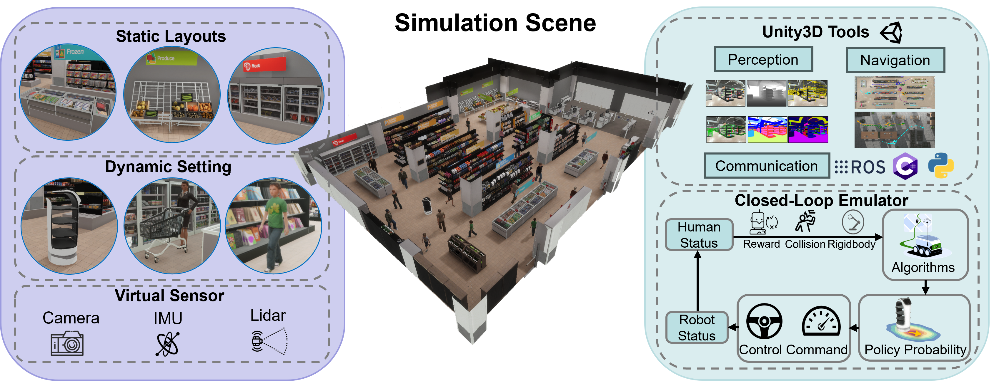

<div align="center">
<h1>THUD++: Large-Scale Dynamic Indoor Scene Dataset and Benchmark for Mobile Robots</h1>

[**Zeshun Li**](https://github.com/lzes)<sup>1*</sup> · [**Fuhao Li**](https://scholar.google.com/citations?user=AXTFYCcAAAAJ&hl=zh-CN&oi=sra)<sup>1*</sup> · [**Wanting Zhang**](https://scholar.google.com/citations?user=V6mBA5IAAAAJ)<sup>1*</sup>
<br>
[**Zijie Zheng**](https://github.com/Anthony-Cheang) · [**Xueping Liu**](https://www.sigs.tsinghua.edu.cn/lxp/main.htm)<sup>1</sup> · [**Tao Zhang**](https://www.pudutech.com/zh-CN)<sup>2</sup> · [**Yongjin Liu**](https://www.cs.tsinghua.edu.cn/info/1116/3535.htm)<sup>1</sup> · [**Long Zeng**](https://jackyzengl.github.io/)<sup>1&dagger;</sup>

<sup>1</sup>THU&emsp;&emsp;&emsp;<sup>2</sup>PUDU Tech
<br>
*equal contribution&emsp;&dagger;corresponding author

<a href="https://arxiv.org/abs/2412.08096"></a>
<a href="https://ieeexplore.ieee.org/abstract/document/10611489"></a>
<a href='https://jackyzengl.github.io/THUD-plus-plus.github.io/'></a>
</div>

## 🧭 Overview

THUD++ comprises three primary components: an RGB-D dataset, a pedestrian trajectory dataset, and a robot navigation emulator. By sharing this dataset, we aim to accelerate the development and testing of mobile robot algorithms,contributing to real-world robotic applications.

## 📃 Usage
### 1. RGB-D Dataset
Please refer to [THUD_Dataset_Overview](https://github.com/jackyzengl/THUD_Dataset_Overview) 

### 2. Pedestrian Trajactory Prediction
#### Prepraration
```bash
git clone https://github.com/jackyzengl/THUD-plus-plus.git
conda create -n thud++ python=3.8
conda activate thud++
pip install -r requirements.txt
```

#### Dataset Structure
The construction of the dataset is the same as that of ETH/UCY. Each row in the dataset is recorded according to frameID, pedID, x, y. The data of each scene is named according to the scene and the corresponding world coordinate system range.
```
Dataset
├── eth
│   ├── train
│   ├── val
│   ├── test_eth
│   ├── test_gym
│   ├── test_hotel
│   ├── test_office
│   ├── test_supermarket
├── gym
│   ├── gym_x[-7,7]_y[-14.4,14.8].txt
├── office
│   ├── office_x[-43.6,-35.5]_y[0.25,17].txt
├── supermarket
│   ├── supermarket_x[-26,-3]_y[-8,8].txt
```

#### Evaluation
```bash
cd traj_pred/tools/FLA/sgan/scripts && python evaluate_model.py
cd traj_pred/tools/FLA/pecnet/scripts && python test_pretrained_model.py
cd traj_pred/tools/FLA/stgcnn && python test.py
```

### 3. Navigation Emulator


#### How to use the emulator

1. Install [Unity](https://unity.com/download) (recommended version ≥ 2022.3.42f1).
2. Download the emulator Unity project from [Google Drive](https://drive.google.com/file/d/1U85FgQ7M-fGek7VBAXhCvFdR8XbWh1eR/view?usp=drive_link) and open it in Unity.
3. Construct customized indoor scenes according to your experimental requirements (rooms, obstacles, pedestrians, robots, etc.).
4. Configure the number of dynamic pedestrians and robots in the scene, and bind the robot controller to communicate with your navigation algorithm via TCP (see below).

#### How to integrate navigation algorithms
#### Preparation
```bash
cd navigation
conda env create -f environment.yml
cd Python-RVO2
python setup.py build
python setup.py install
```

#### Example
We use ORCA as an example to illustrate how the navigation algorithm communicates with Unity.

1. In Python, the script `navigation/tcp_server.py` starts a TCP server (default `HOST=0.0.0.0`, `PORT=11311`) and loads the ORCA policy:
   - Unity sends the robot state and pedestrian states at each simulation step.
   - The server computes the robot velocity and sends back `(vx, vy)` to Unity.

2. Run the TCP server:
```bash
cd navigation
python tcp_server.py
```

3. (Optional) If the navigation algorithm and Unity run on different machines, you can set up SSH port forwarding so that Unity can access the remote Python server. For example:
```bash
ssh -L 11311:localhost:11311 root@<remote_ip> -p <ssh_port>
```

4. In Unity, modify the IP address and port in `Emulator_UnityProject/Assets/Scripts/Robot/RobotManager.cs` so that they match the settings in `tcp_server.py`.  
   The data format sent from Unity to Python is:
```text
robot_pos_x,robot_pos_y & robot_vel_x,robot_vel_y & robot_target_x,robot_target_y &
people1_pos_x,people1_pos_y & people1_vel_x,people1_vel_y & people2_pos_x,people2_pos_y & people2_vel_x,people2_vel_y & ...
```

5. In Unity, select the scene to be tested, open the "ROS" tab in the menu, and click "Start Connection" to start communication with the navigation algorithm. Press the Tab key to show or hide the control menu.

By modifying the policy in `tcp_server.py` (e.g., replacing ORCA with other policies or RL models), you can plug in and evaluate different navigation algorithms in the same emulator.


## 🖊 Citation

If you find this project useful, please consider citing:

```bibtex
@article{li2024thud++,
  title={THUD++: Large-Scale Dynamic Indoor Scene Dataset and Benchmark for Mobile Robots},
  author={Li, Zeshun and Li, Fuhao and Zhang, Wanting and Zheng, Zijie and Liu, Xueping and Liu, Yongjin and Zeng, Long},
  journal={arXiv preprint arXiv:2412.08096},
  year={2024}
}

@article{zhengdemonstrating,
  title={Demonstrating DVS: Dynamic Virtual-Real Simulation Platform for Mobile Robotic Tasks},
  author={Zheng, Zijie and Li, Zeshun and Wang, Yunpeng and Xie, Qinghongbing and Zeng, Long}
  booktitle={Robotics: Science and Systems}
  year={2025}
}

@inproceedings{tang2024mobile,
  title={Mobile robot oriented large-scale indoor dataset for dynamic scene understanding},
  author={Tang, Yi-Fan and Tai, Cong and Chen, Fang-Xing and Zhang, Wan-Ting and Zhang, Tao and Liu, Xue-Ping and Liu, Yong-Jin and Zeng, Long},
  booktitle={2024 IEEE International Conference on Robotics and Automation (ICRA)},
  pages={613--620},
  year={2024},
  organization={IEEE}
}
```
